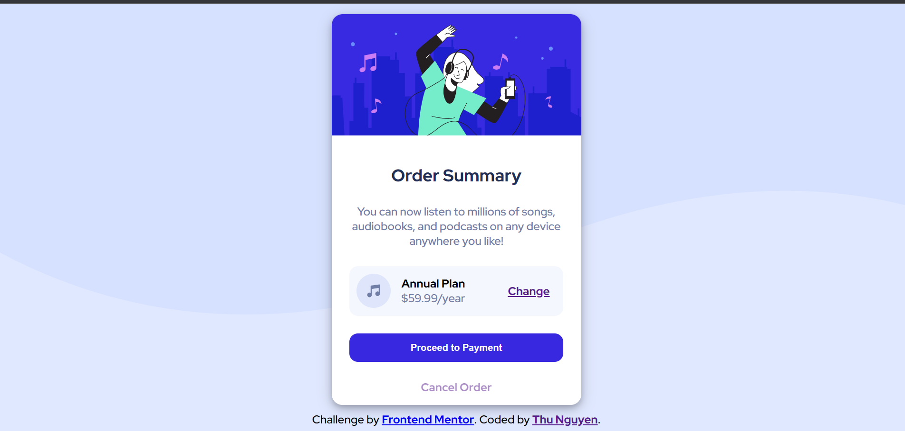

# Frontend Mentor - Order summary card solution

This is a solution to the [Order summary card challenge on Frontend Mentor](https://www.frontendmentor.io/challenges/order-summary-component-QlPmajDUj). Frontend Mentor challenges help you improve your coding skills by building realistic projects. 

## Table of contents

- [Overview](#overview)
  - [The challenge](#the-challenge)
  - [Screenshot](#screenshot)
- [Built with](#built-with)
- [What I learned](#what-i-learned)
- [Continued development](#continued-development)
- [Author](#author)
- [Feedback](#feedback)

## Overview

### The challenge

Users should be able to:

- See hover states for interactive elements

### Screenshot

### Built with

- Semantic HTML5 markup
- CSS 
- Flexbox
- CSS Grid

### What I learned

I learn new CSS properies in this challenge such as a:hover, opacity
I'm also be more familiar with Flexbox layout after this challenge

### Continued development

Make the card more responsive when changing the screen size

## Author

- Website - [Thu Nguyen](https://github.com/NgocMinhThuNguyen)
- Frontend Mentor - [@NgocMinhThuNguyen](https://www.frontendmentor.io/profile/NgocMinhThuNguyen)

## Feedback

I'd be happy to recieve any feedback on the work so that I can improve my skills

Have a nice day!
Thank you!